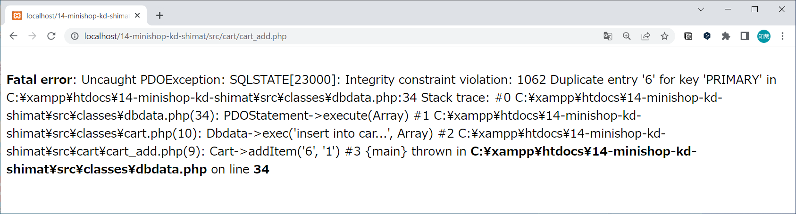
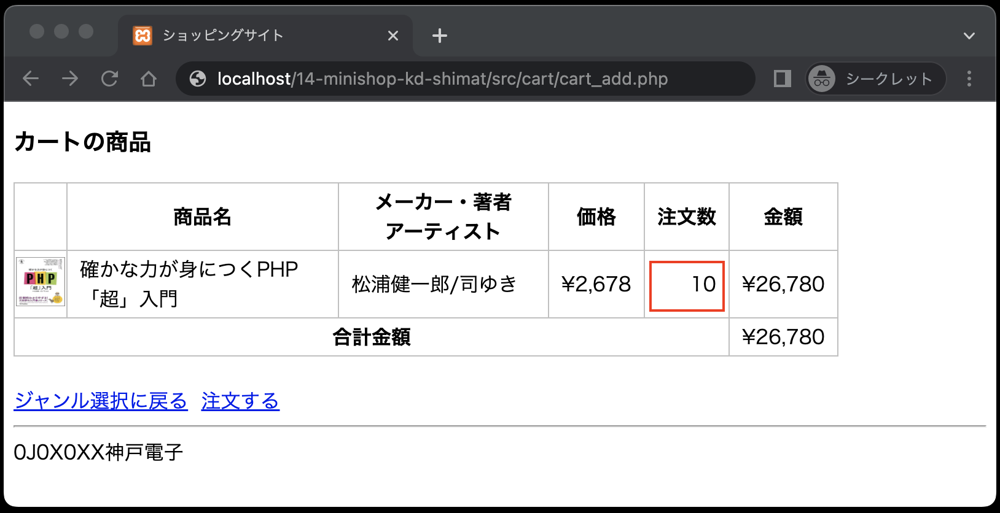

# 仕様書③ : カート内の商品画面のバグ修正

## カート内の商品画面(cart_list.php)のバグ修正

作成したカート内の商品画面(`cart_list.php`)に、以下のバグが発見されたので修正します。

【バグ内容】<br>
カート内に入っている商品と同じ商品を追加しようとするとエラーが発生します。



【修正内容】<br>
すでにカート内に入っている商品をさらに追加しようとした場合、注文数の追加として処理します。
但し、注文数は最大「10」個までとします。

なお、追加して10個以上となる場合、**今回は強制的に10個にします。**
ここではこのことについて正しい正しくないは論じません。
今回作成するWebアプリケーションの「ミニショップ」では、**このような仕様**で進めていきますので、仕様どおりに実装してください。

### クラスCartの修正

修正箇所は、クラス`Cart`の `addItem`メソッドです。
このメソッドを以下のとおりに修正してください。

- 追加しようとしている商品データが既にカート内にあるかどうかをチェックする
   1. 既にカート内にあった場合、その商品の注文数を加算する
      1. ただし、加算した注文数が「10」個を超えた場合、注文数を「10」とする
   2. カート内になかった場合、新たにカートに追加する

## ディレクトリ構成の確認

動作確認をする前に、ディレクトリ構成が以下のようになっていることを確認してください。

```text
public
├── cart
│   ├── cart_add.php ←本章で追加
│   └── cart_list.php ←本章で追加
├── classes
│   ├── cart.php ←本章で追加
│   ├── dbdata.php
│   └── product.php
├── css
│   └── minishop.css
├── images
├── index.php
└── product
    ├── product_detail.php
    └── product_select.php
```

## 動作確認(2回目)

1. １つの商品がカートに入っている状態


2. 同じ商品をさらにカートに入れる(注文数の合計が10を超えないように)


3. 同じ商品がカートに追加され、注文数が加算される


1. 同じ商品をさらにカートに入れる(注文数の合計が10を超えるように)


1. 注文数が「10」となる



**ミニショップのカートに関する機能はまだ完成ではありません。pushはしないでください。**
