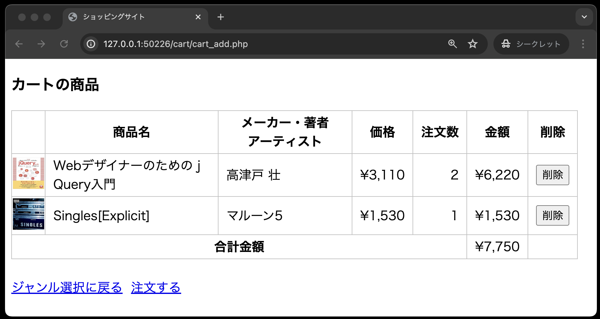
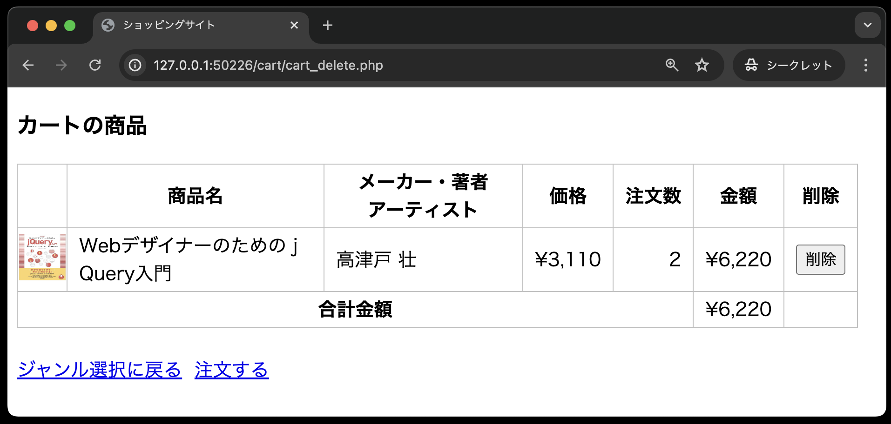

# 仕様書④ : カート内の商品を削除する

## カートの概要説明

カート内の商品画面(`cart_list.php`)には、以下の３つの機能が順番に追加されます。

- カート内に商品を追加する・・・仕様書③で実装する
- カート内の商品を表示する・・・仕様書③で実装する
- 特定の商品をカートから削除する・・・仕様書④で実装する ←本章はここ
- カート内の商品の注文数を変更する・・・仕様書④で実装する


## カート内の商品(cart_list.php)の修正

以下の内容に従い、修正を行なってください。

1. カート内の商品の有無を確認する
   1. 商品がひとつもない場合
      - 「お客様のショッピングカートに商品はありません。」というメッセージを表示する
        - **【補足】「お客様のショッピングカートに商品はありません。」というメッセージは`<h4>`タグでくくること**
      - 「注文する」リンクを削除する<br>
     
   2. 商品がある場合、一覧表を表示するが、以下の修正が必要
      - 一覧表の見出し行に「削除」欄を追加し、各商品の「削除」欄には「削除」ボタンを追加する
        - 「削除」ボタンは、リンクではなく`<form>`タグの中に`<input type="submit>`で実装すること
      - 「削除」ボタンをクリックするとその商品の「商品番号」を商品削除機能(`cart_delete.php`)に送信する
      - リンクは「ジャンル選択に戻る」と「注文する」の２つを表示する(「注文する」のリンク先は、`order/order_now.php` のファイル)<br>
     

## 商品削除(cart_delete.php)の作成

以下の内容に従い、作成を行なってください。

1. カート内の商品(`cart_list.php`)から送られてきた「商品番号」を受け取る
2. クラス`Cart`のオブジェクトを生成し、受け取った「商品番号」を引数として、商品削除メソッド(`deleteItem`)を呼び出す
3. カート内の商品画面(`cart_list.php`)を読み込む<br>

なお、商品削除機能(`cart_delete.php`)の作成については、「仕様書③ : カート内の商品画面、カート内の商品画面のバグ修正」の商品追加機能(`cart_add.php`)を参考にすると作りやすいです。

## クラスCart(cart.php)の修正

引数として受け取った「商品番号」をキーに、テーブルcartから該当商品を削除する「商品削除メソッド」を以下の仕様で定義します。

```text
アクセス修飾子: public
メソッド名: deleteItem
引数: $ident(商品番号)
戻り値: なし
```

## ディレクトリ構成の確認

動作確認をする前に、ディレクトリ構成が以下のようになっていることを確認してください。

```text
public
├── cart
│   ├── cart_add.php
│   ├── cart_delete.php ←本章で追加
│   └── cart_list.php
├── classes
│   ├── cart.php
│   ├── dbdata.php
│   └── product.php
├── css
│   └── minishop.css
├── images
├── index.php
└── product
    ├── product_detail.php
    └── product_select.php
```

### 動作確認

カート内に複数の商品を入れ、一つ一つ削除していき、最後にカート内に商品が入っていない状態を確認してください。

1. カート内に２つの商品が入っている状態から、1つの商品を削除する


2. 残りの商品も削除する



3. カート内に商品がない場合の画面となり、「注文する」のリンクが無くなる

