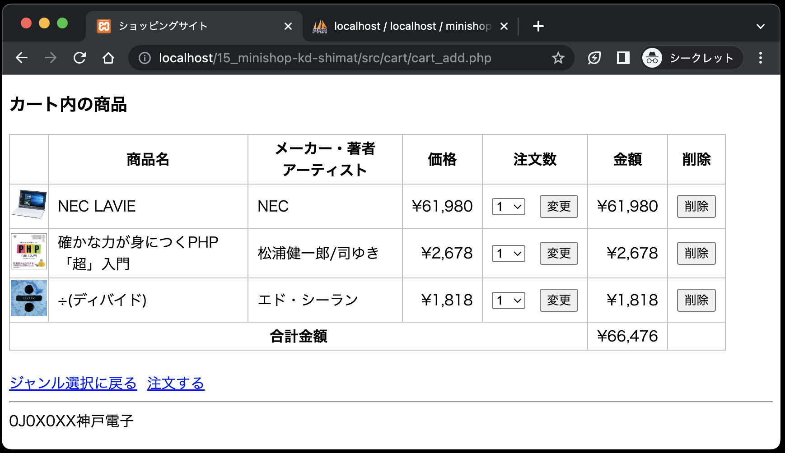
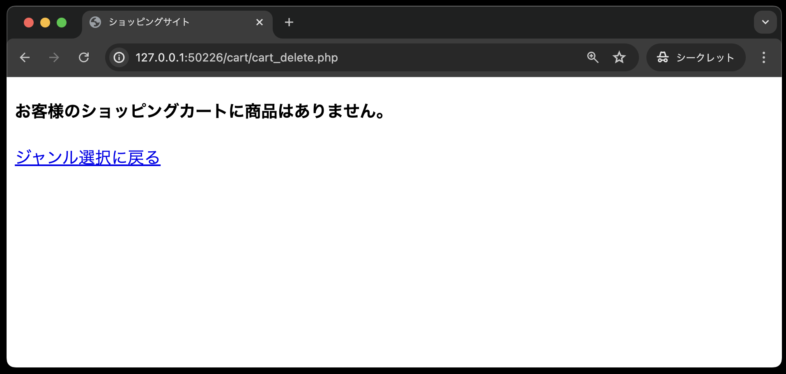
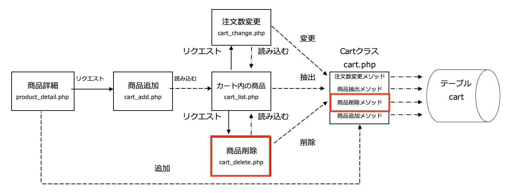

# カートの概要説明

カート内の商品画面には、以下の4つの機能があります。

- カート内に商品を追加する・・・仕様書③で実装する
- カート内の商品を表示する・・・仕様書③で実装する
- 商品をカートから削除する・・・仕様書④で実装する
- 商品の注文数を変更する・・・仕様書⑤で実装する

上記の機能を実装した完成画面が以下となります。

カート内に商品がない場合は以下の画面となります。

各機能の大まかな実装手順は以下のとおりです。

1. カート内に商品を追加する・・・仕様書③で実装する
   - 商品追加機能(cart_add.php)を実装する。
     - 商品追加機能(cart_add.php)は、`Cart`クラスの商品追加メソッド(`addItem`)を呼び出し、指定された商品を追加した後、カート内の商品画面(cart_list.php)を読み込む。

2. カート内の商品を表示する・・・仕様書③で実装する
   - `Cart`クラスの商品抽出メソッド(`getItems`)を呼び出し、テーブルcart内のすべてのデータを抽出する。
   - 抽出したデータをカート内の商品画面(cart_list.php)に表示する。

3. 商品をカートから削除する・・・仕様書④で実装する 
   - カート内の商品画面(cart_list.php)に以下の修正を加える。
     - 一覧表の見出し行に「削除」欄を追加し、各商品の「削除」欄には「削除」ボタンを追加する。
     - 「削除」ボタンをクリックするとその商品の「商品番号」を商品削除機能(cart_delete.php)に送信する。
   - 商品削除機能(cart_delete.php)を実装する。
     - 商品削除機能(cart_delete.php)は、`Cart`クラスの商品削除メソッド(`deleteItem`)を呼び出し、指定された商品を削除した後、カート内の商品画面(cart_list.php)を読み込む。

4. 商品の注文数を変更する・・・仕様書⑤で実装する 
   - カート内の商品画面(car_list.php)の注文数の欄に次の修正を行う。
     - テーブルcartに登録されている注文数を最大値「10」までのプルダウンメニューで表示する。
     - 「変更」ボタンを追加し、クリックすると、注文数変更機能(cart_change.php)にデータを送信する。
     - 注文数変更機能(cart_change.php)を実装する。
       - 注文数変更機能(cart_change.php)は、`Cart`クラスの注文数変更メソッド(`changeQuantity`)を呼び出し、注文数の変更処理を行った後、カート内の商品画面(cart_list.php)を読み込む。

今回新規作成する各ファイルと相互間のやり取りは以下のような図となる。

